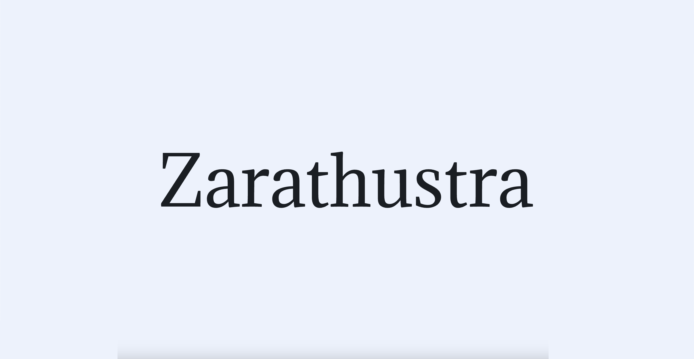
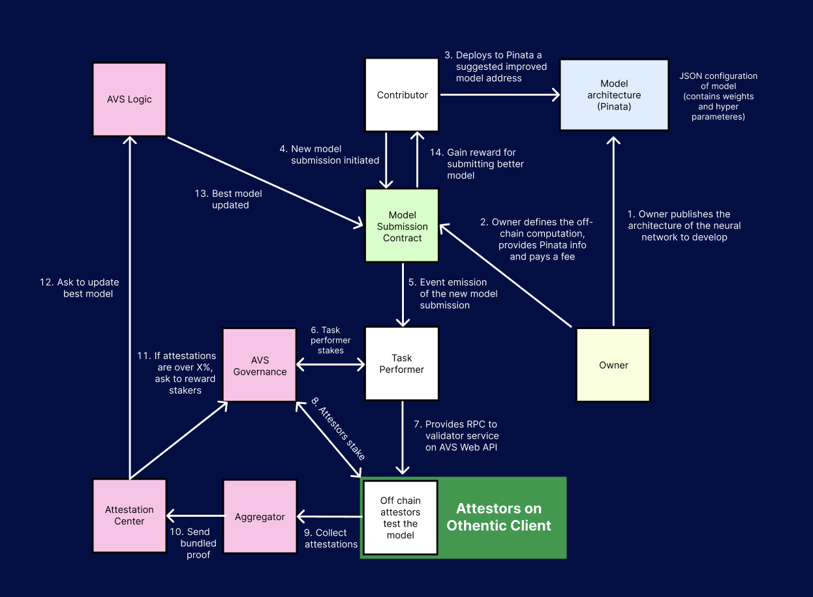

# 🦓 Zarathustra AI



## Key Links

[Zarathustra Docs](https://zarathustra-1.gitbook.io/zarathustra-ai/ "Zarathustra Docs")

## What is Zarathustra AI?

Zarathustra AI is a marketplace for open source machine learning models development. It utilizes cryptocurrency economics for positive incentive alignment to coordinate communities of developers to push AI innovation even further.

Project owner will publish the architecture of a neural network and initial model parameters, this ensures that the computational complexity remains within the desired bounds of the architecture. He will also allocate space and share the address on a decentralized storage platform where model submissions from the optimizers will be stored.

Subsequently, the project owner will submit the code that will be used to determine the model's accuracy. With this complete information, model optimizers can understand the intended functionality of the model and can start training a model.

A crucial aspect is that optimizers cannot know beforehand on what data their model will be tested. This is achieved by generating a deterministic but unpredictable number, which decides the input data to be generated, preventing the model from overfitting to predefined values.

Once an optimizer completes the training, they submit their model to decentralized storage. The network of Task Performers and attesters then pick up on this event and run testing code to evaluate the model. The model's output, combined with the input data, is measured by a function that returns an accuracy score. If the tests indicate improvement, the optimizer receives a reward.

Protocols like Zarathustra are essential for numerous reasons. Critically, in a world where AI development lacks openness, transparency, and accountability, we face the potential of misuse, biases, and the concentration of power among a few entities. Open platforms with robust economic incentives also yield the possibility of not only supercharging innovation in AI, but also enabling unprecedented coordination among developers in a way that was previously thought impossible, unlocking new design verticals and ensuring equitable development.

## Diagram



## Core Entities

The Zarathustra protocol contains 4 critical entities.

### Project Owner

The project owner is an entity that publishes the neural network architecture and initial parameters. The owner uploads the architecture to a decentralized database and, after paying a fee and defining the nature of the off-chain computation, interacts with a smart contract. The off-chain computation, which is the code that operators will run to evaluate the model, indirectly defines the model's goal so that optimizers understand how the model should behave. The owner provides the smart contract with pointers to the model architecture, the model parameters, and the evaluation code, all stored in decentralized storage.

### Contributors

The contributor is someone who has seen (through the frontend) the project owner's request for neural network development. After judging if the fee would be enticing to them, they run their own off-chain computations and develop an improved model. Contributors then submit their improved version to a smart contract, with a pointer to the new trained neural network parameters on a decentralized database. 

### Task Performers

Task performers are the first line of validity for the protocol. After seeing an event emission that was triggered by the new model submission of the contributors, they perform an off-chain computation to determine if the new neural network submission is an improvement from the previous. After they have concluded a result, they submit their findings to the AVS Web API via an RPC. 

### Attesters

Attesters are the second line of validity for the protocol. After seeing the result of the task performer, they themselves will make a collective decision as to the validity of the new suggested model. A large number of attesters will perform off-chain calculations to confirm the conclusion of the task performer. If a large majority of over 66% agree with the computation, then their attestations will serve as a final confirmation of the new model, at which point the circuit will conclude with the distribution of economic rewards for those participants who acted to the benefit of the protocol, and an update to everone of the best fit neural network. 

## Core Contracts

The Zarathustra protocol contains 5 critical contracts.

### Model Submission Contract

The model submission contract is the brain of the Zarathustra protocol. It controls multiple important aspects which are responsible for different vital operations. Primarily, the model submission contract is responsible for receiving the original model improvement request (from the owner) and the improved model submissions from the contributors. In the midst of this process, it is also in charge of emitting an event emission upon the reception of an improvement submission, and keeping track of different submissions occuring. Finally, the model submission contract is responsible for the charging and paying out of fees. It should be noted that this is a completely seperate process from staking. The project owner pays out a fee to the model submission contract for requesting to get their model improved, and a reward is payed out to the contributor who sucessfully improves it. If the model improved, the address that points to the current (challanged) model will change to the address of the improved (challanging) model. This will alternate every successful improvement

### Aggregator

The aggregator is responsible for collecting individual BLS signatures from multiple attestors and combining them into a single, aggregated signature. This process significantly reduces the amount of data that needs to be processed and validated by the network, enhancing efficiency and scalability. By minimizing the computational resources required for verification, the aggregator helps maintain the decentralized nature and sustainability of the blockchain ecosystem.  If any response passes the quorum threshold set when posting a task, the aggregator posts the aggregated response to the attestation center. 

### Attestation Center

The attestation center contract manages the broader attestation process within a decentralized network. It receives the aggregated signatures from the aggregator, validates the tasks and signatures, and coordinates payments to the operators based on their contributions. This contract ensures efficient task submission and reward distribution, enhancing network security and scalability. Additionally, it maintains decentralized governance and accountability through a structured role and permission system, fostering transparent coordination and incentivization of operators to create a robust and fair ecosystem.

### AVS Logic

The AVS logic contract is a small yet signifcant part of the Zarathustra protocol. It communicates to the model submission contract the model that was validated as improved from the attestations in the attestation center. This allows for a communication between the brain of the protocol and the end of the secure and decentralized validation process.

### AVS Governance

The AVS Governance contract manages the registration and deregistration of operators, enforces governance policies, and coordinates interactions between operators and various components of the system. It uses roles and access controls to manage permissions and ensure security. The contract handles operator deposits and rewards, and allows for the update of governance logic and settings. Additionally, it interfaces with other contracts for message handling, registry management, and signature verification to maintain the integrity and functionality of the governance framework.

## AVS Node Specification Compliance

Every AVS node implementation is required to follow the Eigenlayer AVS Node Specification. The current hard requirements are only to implement the AVS Node API and implement the Eigenlayer prometheus metrics.

## Example Workflow

Let's explore how the Zarathustra workflow functions with a simple example: a neural network modeling the function \( f(x) = x^2 \).

The owner aims to find the most accurate model given a specific architecture. Here's how the process unfolds:

1. **Deployment**: The owner deploys a small MLP (Multi-Layer Perceptron) architecture as a JSON file into decentralized storage and shares the address.

2. **Defining the Test Function**: The owner defines a test function that takes a random number as input and returns an accuracy score. The function works as follows:
   1. Retrieve the model architecture and parameters of the model being tested.
   2. Build the model using the architecture and load the parameters.
   3. Perform inference with the given random number as input (more inputs can be generated for thorough testing, but we'll keep it simple for this example).
   4. Compare the model's output with the expected \( \text{input}^2 \) using R-squared.
   5. The result of this comparison is the model's accuracy, which is sent as the computation result.

3. **Initial Submission**: The owner submits the initial model and provides tokens to the Model Submission Contract to cover fees and rewards.

4. **Optimizer Involvement**: Optimizers see the new task published by the owner and attempt to train a model that meets the test requirements given the architecture.

5. **Model Submission**: After training, an optimizer submits their model by storing the parameters at the challenging model address and triggering the Model Submission Contract. This action emits an event to the Task Performers indicating the need to test the model.

6. **Testing and Verification**: Task Performers run the provided test function and submit the result. Attesters verify the results, and an aggregator collects them. The attestation center rewards the AVSes and signals the AVS logic.

7. **Evaluation and Reward**: The AVS logic signals the verdict to the Model Submission Contract. The contract compares the new model's accuracy with the previous model's accuracy.
   - If the new model performs worse, the optimizer will get slashed (not yet implemented).
   - If the new model performs better, the current accuracy is updated, and the model address is redirected to the improved model. This redirection occurs with every successful model improvement.

8. **Reward Distribution**: The optimizer is rewarded from the tokens provided by the owner within the Model Submission Contract.


## Why we went with this approach
One of the most challenging aspects of decentralized model training is determining whether the model has genuinely improved. Traditional benchmarks are ineffective because models could simply overfit (memorize) all input-output pairs instead of learning to model the underlying function. To address this, we decided not to share the data used for testing the models. Instead, we generate the testing data on the fly once the model is submitted. This way, optimizers cannot predict the test data and are forced to train a model that can handle all inputs well, resulting in a model that is well-generalized and not overfitted.

Another significant challenge was handling the economic aspect. We opted for a more open market approach, where the project owner defines the desired outcome of the model (through the off-chain test) and allows anyone to optimize the model. The project owner covers all associated fees (storage fees, AVS rewards, optimizer rewards), but in return, they gain access to a global pool of machine learning engineers. This open access allows the project owner to benefit from diverse expertise and innovative solutions, enhancing the overall quality and performance of the model.

## ▶️ Run the demo

We provide a sample docker-compose configuration which sets up the following
services:

- Aggregator node
- 3 Attester nodes
- AVS WebAPI endpoint
- TaskPerformer endpoint

To set up the environment, create a `.env` file with the usual Othentic
configurations (see the `.env.example`), then run:
```console
docker-compose up --build
```

> [!NOTE]
> This might take a few minutes when building the images

### Updating the Othentic node version
To update the `othentic-cli` inside the docker images to the latest version, you
need to rebuild the images using the following command:
```console
docker-compose build --no-cache
```

## 🏗️ Architecture
The Othentic Attester nodes communicate with an AVS WebAPI endpoint which
validates tasks on behalf of the nodes. The attesters then sign the tasks based
on the AVS WebAPI response.

Attester nodes can either all communicate with a centralized endpoint or each
implement their own validation logic.

### AVS WebAPI
```
POST task/validate returns (bool) {"proofOfTask": "{proofOfTask}"};
```
