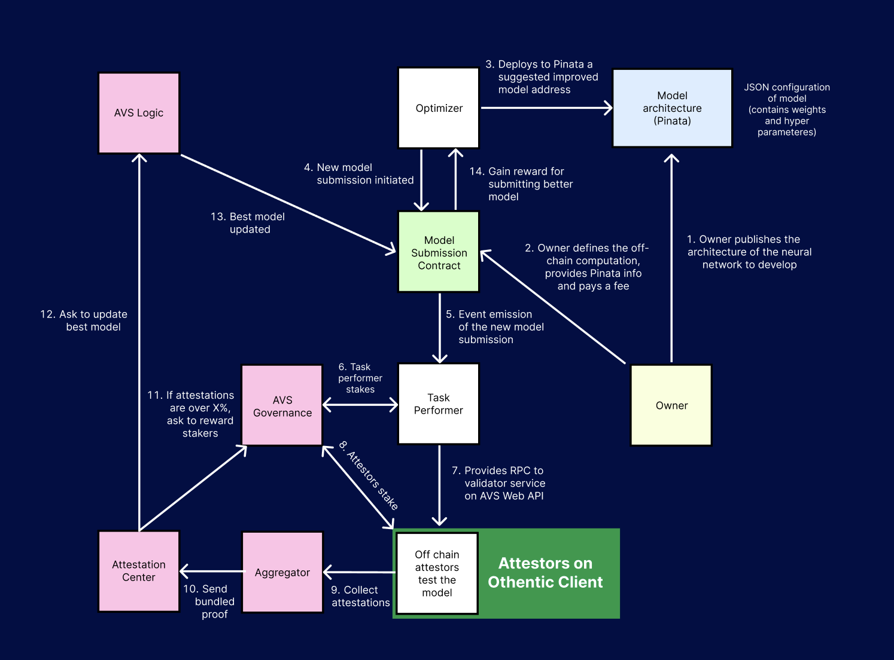

# 🦓 Zarathustra AI


## What is Zarathustra AI?

Zarathustra AI is a marketplace for open source artificial intelligence development. It utilizes cryptocurrency economics for positive incentive alignment to coordinate communities of developers to push AI innovation even further.

Project owners can publish an architecture of a neural network that they want improved on a decentralized database. Developers can then use this information to suggest new models with the potential to earn token rewards. These new suggested models are then checked by a network of performers and attesters to confirm the validity of the suggested improvements.

Protocols like Zarathustra are essential for numerous reasons. Critically, in a world where AI development lacks openness, transparency, and accountability, we face the potential of misuse, biases, and the concentration of power among a few entities. Open platforms with robust economic incentives also yield the possibility of not only supercharging innovation in AI, but also enabling unprecedented coordination among developers in a way that was previously thought impossible, unlocking new design verticals and ensuring equitable development.

## Diagram



## Core Entities

The Zarathustra protocol contains 4 critical entities.

### Project Owner

The project owner is an entity that publishes an initial neural network architecture that they would like to improve. They do so by uploading their architecture to a decentralized database and then, after paying a fee and defining the nature of the off-chain computation, interact with a smart contract. The owner provides the smart contract with these details along with a pointer to the architecture they would like improved. 

### Contributors

The contributor is someone who has seen (through the frontend) the project owner's request for neural network development. After judging if the fee would be enticing to them, they run their own off-chain computations and develop an improved model. Contributors then submit their improved version to a smart contract, with a pointer to the new neural network on a decentralized database. 

### Task Performers

Task performers are the first line of validity for the protocol. After seeing an event emission that was triggered by the new model submission of the contributors, they perform an off-chain computation to determine if the new neural network submission is an improvement from the previous. How they do this is open ended, but for our deployment we've utilized an adjusted R squared calculation to determine model fit. After they have concluded a result, they submit their findings to the AVS Web API via an RPC. 

### Attesters

Attesters are the second line of validity for the protocol. After seeing the result of the task performer, they themselves will make a collective decision as to the validity of the new suggested model. A large number of attesters will perform off-chain calculations to confirm the conclusion of the task performer. If a large majority of over 66% agree with the computation, then their attestations will serve as a final confirmation of the new neural network, at which point the circuit will conclude with the distribution of economic rewards for those participants who acted to the benefit of the protocol, and an update to everone of the best fit neural network. 

## Core Contracts

The Zarathustra protocol contains 5 critical contracts.

### Model Submission Contract

The model submission contract is the brain of the Zarathustra protocol. It controls multiple important aspects which are responsible for different vital operations. Primarily, the model submission contract is responsible for receiving the original model improvement request (from the owner) and the improved model submissions from the contributors. In the midst of this process, it is also in charge of emitting an event emission upon the reception of an improvement submission, and keeping track of different submissions occuring. Finally, the model submission contract is responsible for the charging and paying out of fees. It should be noted that this is a completely seperate process from staking. The project owner pays out a fee to the model submission contract for requesting to get their neural network improved, and a reward is payed out to the contributor who sucessfully improves it.

### Aggregator

The aggregator is responsible for collecting individual BLS signatures from multiple attestors and combining them into a single, aggregated signature. This process significantly reduces the amount of data that needs to be processed and validated by the network, enhancing efficiency and scalability. By minimizing the computational resources required for verification, the aggregator helps maintain the decentralized nature and sustainability of the blockchain ecosystem.  If any response passes the quorum threshold set when posting a task, the aggregator posts the aggregated response to the attestation center. 

### Attestation Center

The attestation center contract manages the broader attestation process within a decentralized network. It receives the aggregated signatures from the aggregator, validates the tasks and signatures, and coordinates payments to the operators based on their contributions. This contract ensures efficient task submission and reward distribution, enhancing network security and scalability. Additionally, it maintains decentralized governance and accountability through a structured role and permission system, fostering transparent coordination and incentivization of operators to create a robust and fair ecosystem.

### AVS Logic

The AVS logic contract is a small yet signifcant part of the Zarathustra protocol. It communicates to the model submission contract the model that was validated as improved from the attestations in the attestation center. This allows for a communication between the brain of the protocol and the end of the secure and decentralized validation process.

### AVS Governance

The AVS Governance contract manages the registration and deregistration of operators, enforces governance policies, and coordinates interactions between operators and various components of the system. It uses roles and access controls to manage permissions and ensure security. The contract handles operator deposits and rewards, and allows for the update of governance logic and settings. Additionally, it interfaces with other contracts for message handling, registry management, and signature verification to maintain the integrity and functionality of the governance framework.

## AVS Node Specification Compliance

Every AVS node implementation is required to follow the Eigenlayer AVS Node Specification. The current hard requirements are only to implement the AVS Node API and implement the Eigenlayer prometheus metrics.

## ▶️ Run the demo

We provide a sample docker-compose configuration which sets up the following
services:

- Aggregator node
- 3 Attester nodes
- AVS WebAPI endpoint
- TaskPerformer endpoint

To set up the environment, create a `.env` file with the usual Othentic
configurations (see the `.env.example`), then run:
```console
docker-compose up --build
```

> [!NOTE]
> This might take a few minutes when building the images

### Updating the Othentic node version
To update the `othentic-cli` inside the docker images to the latest version, you
need to rebuild the images using the following command:
```console
docker-compose build --no-cache
```

## 🏗️ Architecture
The Othentic Attester nodes communicate with an AVS WebAPI endpoint which
validates tasks on behalf of the nodes. The attesters then sign the tasks based
on the AVS WebAPI response.

Attester nodes can either all communicate with a centralized endpoint or each
implement their own validation logic.

### AVS WebAPI
```
POST task/validate returns (bool) {"proofOfTask": "{proofOfTask}"};
```
